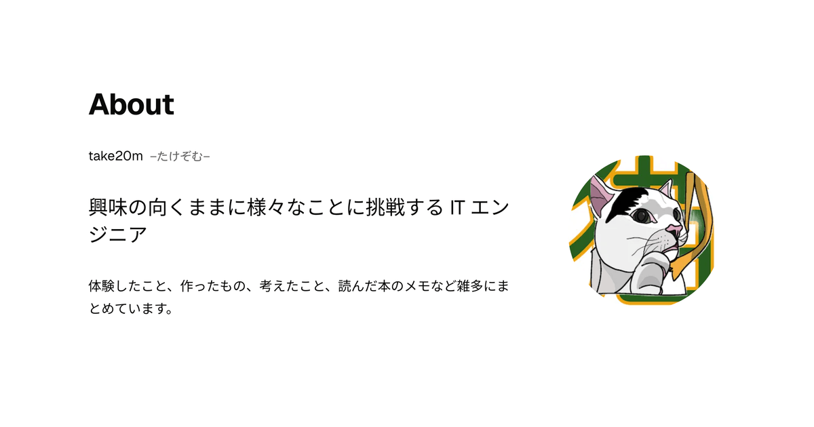

# ポートフォリオサイト

体験したこと、作ったもの、考えたこと、読んだ本のメモなど雑多に記録として残せる場所が欲しかったので、ポートフォリオサイトとして作成しました。 
ミニマルでタイポグラフィックなデザインを目指しました。

  
  
  

## 構成

- 静的サイト（`output: 'static'`）
- ページ: `/`（Top + About）/ `/works/` / `/works/<slug>/` / `/blog/` /
  `/blog/<slug>/` / `/404`
- Content Collections (`src/content.config.ts`) で `works` と `blog` を
  MDXで管理
- フォントは `@fontsource-variable/geist` と `@fontsource/noto-sans-jp` を使用
- カラーは `src/styles/global.css` に定義
